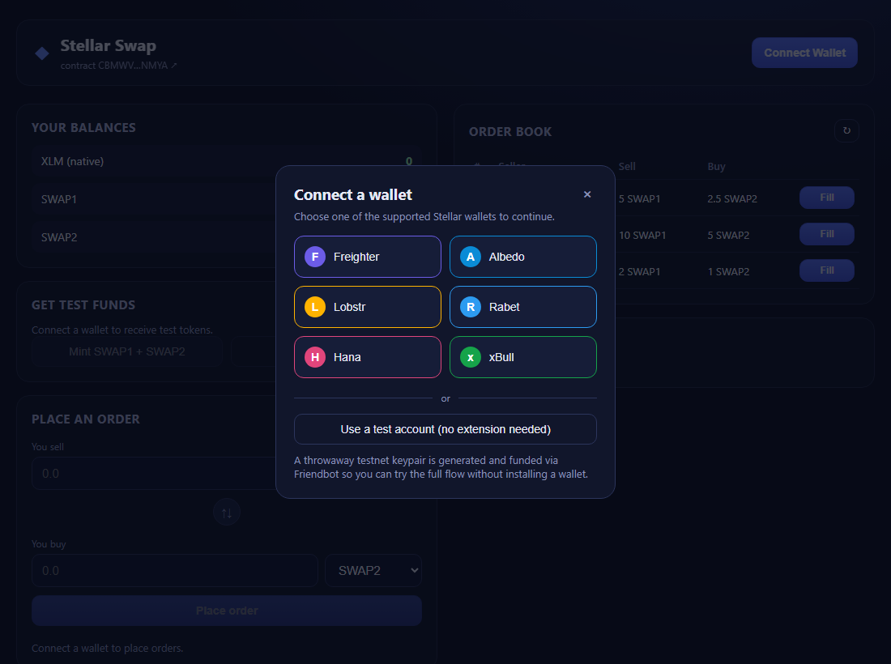
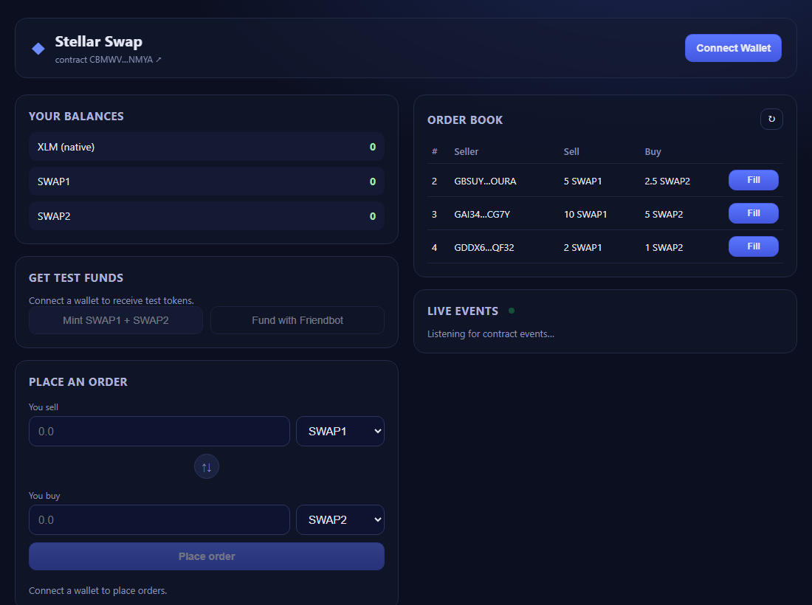

# Stellar Swap — Token Swap Interface (Level 2)

A **multi-wallet Token Swap Interface** built on Stellar. It talks to a custom
**Soroban smart contract** that implements a tiny on-chain **orderbook** (the
Stellar DEX model): sellers deposit tokens to create limit orders, fillers swap
against them, and sellers can cancel. The UI is built with React + Vite, uses
**StellarWalletsKit** for multi-wallet support, and tracks every transaction and
contract event in real time.

> Network: **Stellar Testnet** · RPC: `https://soroban-testnet.stellar.org`

---

## ✅ Submission checklist

| Requirement | Status |
| --- | --- |
| Public GitHub repository | ✅ (push this repo) |
| README with setup instructions | ✅ this file |
| Minimum 2+ meaningful commits | ✅ **14+ commits** |
| Screenshot: wallet options available | ✅ [`docs/wallet-options.png`](docs/wallet-options.png) |
| Deployed contract address | ✅ `CBMWVFURV5P4KA5MRHRU62D63C2S6F3SPOQ3RPBFTJNFNB65VHA3NMYA` |
| Transaction hash of a contract call | ✅ `b29ffeeede08accd94a2220622650ac6e3f17dfac59213e62407a814c2b8ee1e` |
| Live demo link (optional) | Deploy the static build to Vercel/Netlify (see below) |

### Deployed contract (testnet)
- **Swap / orderbook contract:** [`CBMWVFURV5P4KA5MRHRU62D63C2S6F3SPOQ3RPBFTJNFNB65VHA3NMYA`](https://stellar.expert/explorer/testnet/contract/CBMWVFURV5P4KA5MRHRU62D63C2S6F3SPOQ3RPBFTJNFNB65VHA3NMYA)
- **Demo tokens (contract-native, no trustline required):** `SWAP1` & `SWAP2` — minted through the contract `faucet` (100 000 tokens each).

### Verifiable contract call (testnet)
- `place_order` transaction hash:
  [`b29ffeeede08accd94a2220622650ac6e3f17dfac59213e62407a814c2b8ee1e`](https://stellar.expert/explorer/testnet/tx/b29ffeeede08accd94a2220622650ac6e3f17dfac59213e62407a814c2b8ee1e)

### Wallet options screenshot


---

## 🚀 Setup & run

```bash
# 1. Install dependencies (React app + Stellar SDK + StellarWalletsKit)
npm install

# 2. Run the dev server
npm run dev
# open the printed http://localhost:5173 URL
```

Build for production:

```bash
npm run build      # type-checks + bundles to dist/
npm run preview    # serve the production build locally
```

### Deploying the contract yourself (optional)
The contract is already deployed on testnet (address above). To redeploy:

```bash
# install the stellar CLI and a Rust wasm32v1-none toolchain, then:
bash scripts/deploy-testnet.sh
# update src/config.ts with the printed addresses
```
See [`contract/README.md`](contract/README.md) for the contract API and build steps.

### Deploy the frontend (optional live demo)
The app is a static SPA. Deploy `dist/` to Vercel, Netlify, GitHub Pages, etc.:

```bash
npm run build
# drag-and-drop the dist/ folder into Vercel/Netlify, or:
npx vercel deploy --prebuilt
```

---

## 🧩 How it maps to the Level 2 learning goals

| Goal | Where it lives |
| --- | --- |
| **StellarWalletsKit implementation** | `src/lib/kit.ts` registers Freighter, Albedo, Lobstr, Rabet, Hana & xBull; `src/components/WalletModal.tsx` lets the user pick a wallet. |
| **Error handling** (wallet not found / rejected / insufficient balance) | `src/lib/errors.ts` (`classifyError`) + `src/components/ErrorBanner.tsx`. Connect failures, user rejections and low balances are caught and shown with a specific message. |
| **Deploying a contract to testnet** | `contract/` → `swap_contract.wasm`, deployed via `scripts/deploy-testnet.sh`. |
| **Calling contract functions from the frontend** | `src/lib/stellar.ts` (`place_order`, `fill_order`, `cancel_order`, `faucet`) are invoked from the UI. |
| **Reading / writing data to a contract** | `get_orders()` reads the orderbook; `place_order`/`fill_order`/`cancel_order`/`faucet` write state. |
| **Event listening & state synchronization** | `fetchContractEvents` + a 5s polling loop in `src/hooks/useSwap.ts` re-syncs the orderbook on `order_placed` / `order_filled` / `order_cancelled`. |
| **Transaction status tracking (pending/success/fail)** | `submitOperation` + `waitForTransaction` in `src/lib/stellar.ts`; the live badge is rendered by `src/components/TxStatus.tsx`. |

### The three required error types
1. **Wallet not found** — when no Stellar wallet extension/app is available, `authModal()` throws and `classifyError` shows *“No Stellar wallet found. Install a wallet such as Freighter…”*.
2. **Rejected** — when the user declines signing in their wallet, the rejection is caught and shown as *“Transaction rejected in the wallet…”*.
3. **Insufficient balance** — before sending, the app checks the account’s XLM (via Friendbot funding) and the held token amount; if too low it shows *“Insufficient balance to pay the network fee / to place this sell order.”*.

---

## 🖼️ App overview


- **Connect** any of the supported wallets.
- **Get test funds**: fund the account with Friendbot (testnet XLM) and mint `SWAP1`/`SWAP2` demo tokens via the contract faucet.
- **Place an order**: choose sell/buy tokens and amounts; the contract pulls the sold tokens and records the order.
- **Fill / Cancel** orders from the order book.
- **Live transaction status** and a **streaming event log** keep you in sync with the chain.

## 🛠 Tech stack
- Frontend: React 19 + Vite + TypeScript
- Stellar: `@stellar/stellar-sdk`, `@creit.tech/stellar-wallets-kit`
- Contract: Rust + `soroban-sdk` 27 (Soroban / Stellar smart contracts)
